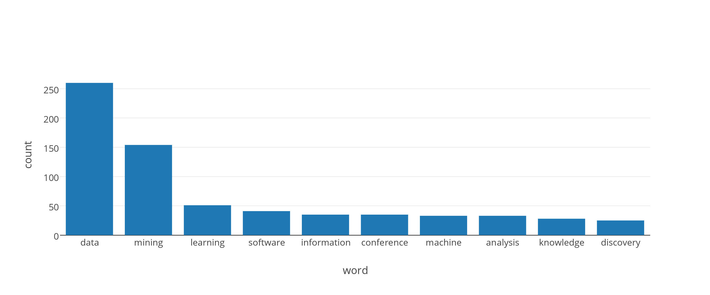

# keyword miner

Extract a list of keywords from a website, sorted by word count. Uses [text-miner](https://github.com/Planeshifter/text-miner) and [cheerio](https://github.com/cheeriojs/cheerio) for HTML/text parsing.

Top 10 keywords for https://en.wikipedia.org/wiki/Data_mining:



### Usage

```bash
$ npm install keyword-miner
```

```javascript
/**
 * keyword-miner exports a function with the following params:
 * @param {String|Object} url string or options object
 * @param {Function} done
 **/
var miner = require('keyword-miner');

var options = {
  site: 'https://en.wikipedia.org/wiki/Data_mining',

  // only include words with at least n occurences, default 0 (no threshold)
  threshold: 5,

  // limit output count, default 0 (no limit)
  limit: 20,

  // css element(s) to get keywords from, default 'body'
  element: 'body',

  // exclude keywords, default []
  exclude: []
};

// call function and print results when done
miner(
  options,
  (error, words) => {
    if (error)
      throw error;

    console.log('words:', words);
  }
);
```
